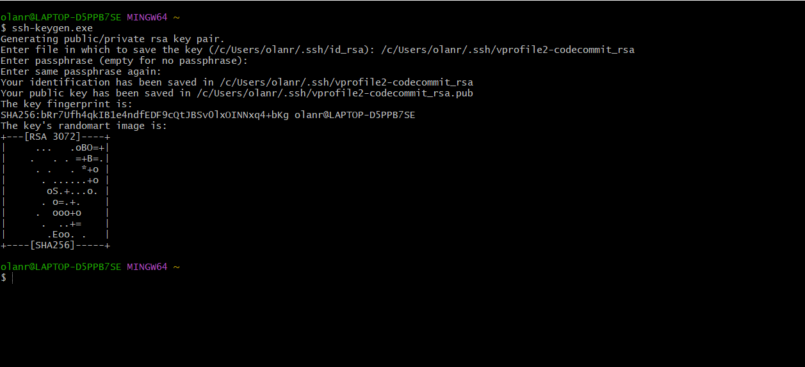
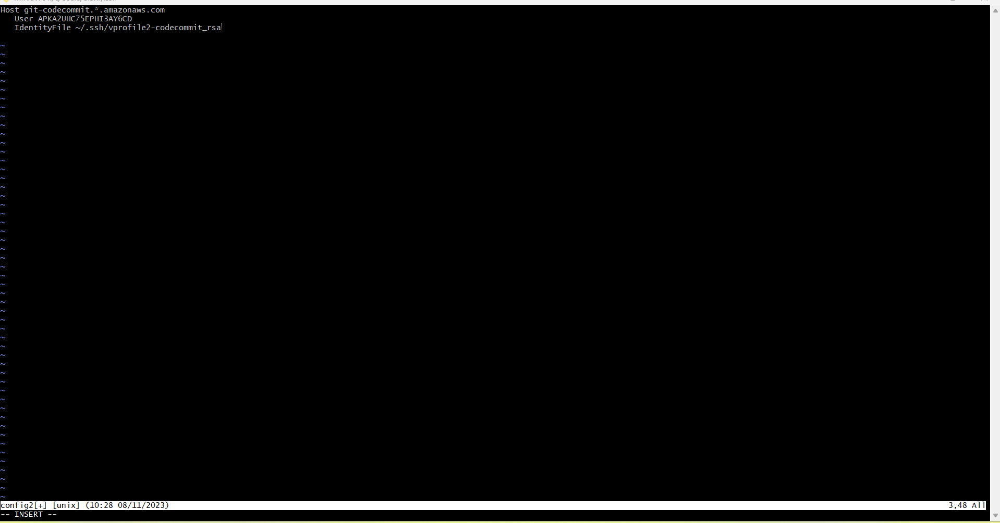
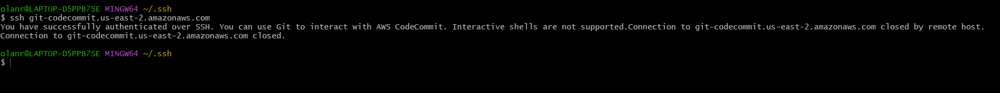
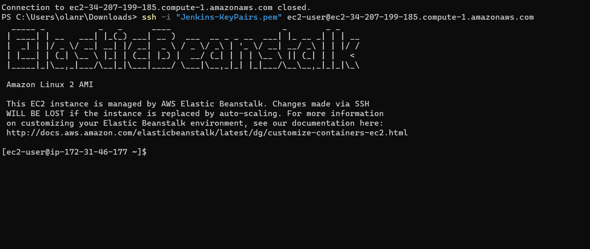
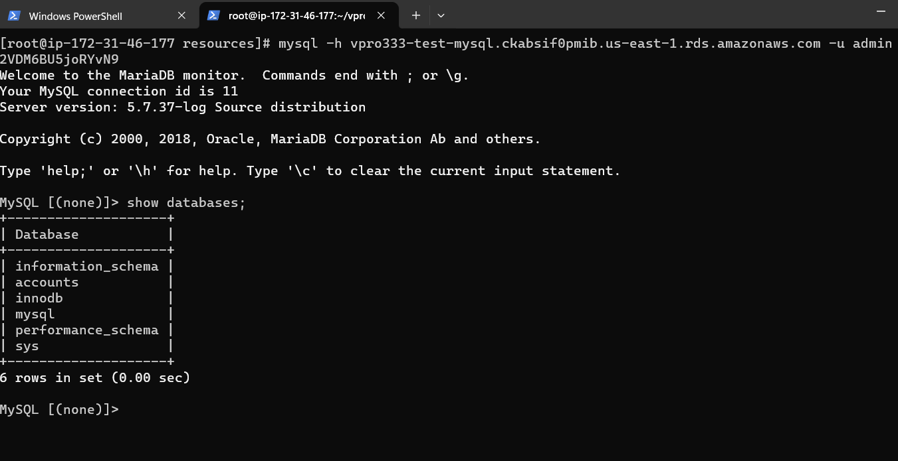
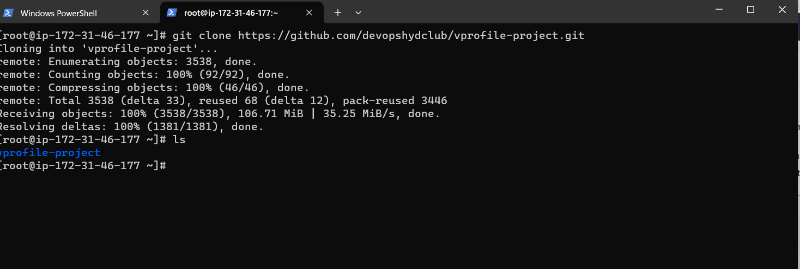
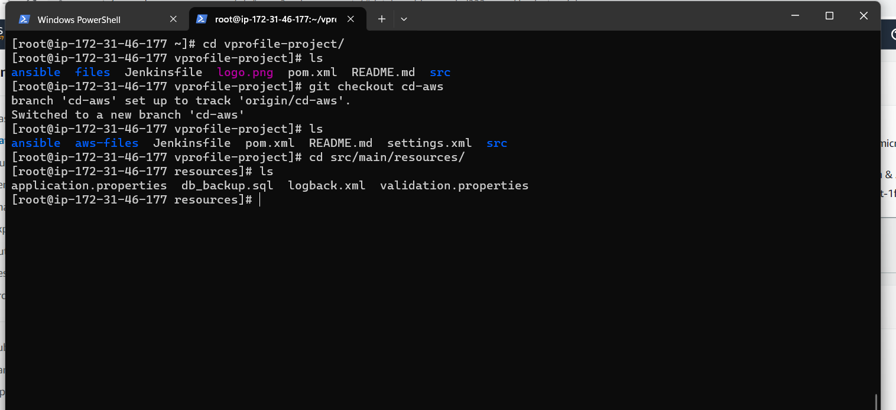
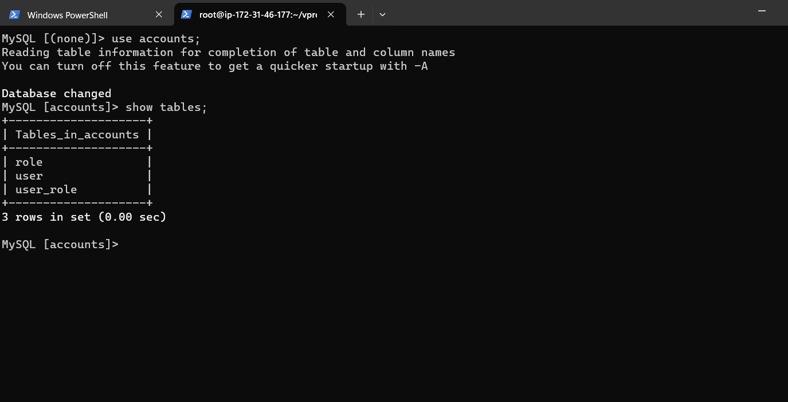
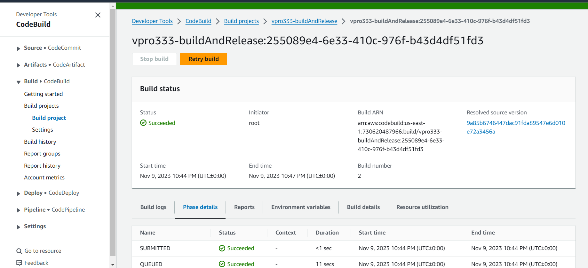

# Continuous Delivery on AWS Cloud [Java Application]

## Flow of Execution
* Login to AWS account
* Code Commit
    * Create codecommit repo
    * Syn it with local repository
* Code Artifact
    * Create repository
    * Update settings.xml file in source code top level directory
    * update pom.xml file with repo details
    * Generate token and store in SSM parameter store
* Sonar Setup
    * Create sonar cloud account
    * Generate token and store in ssm parameter store
    * Create build project
    * Update codebuild role to access SSMparameter
* Create notification for sns or slack
* Build Project
    * Create variables in  SSM => parameter
    * Create build project
* Create Pipeline
    * Codecommit 
    * Testcode
    * Build
    * Deploy to s3 bucket
* Test Pipeline
* Create Beanstalk & RDS
* Update RDS sec grp
* Deploy DB in rds
* Switch to cd-aws branch
* Update settings.xml & pom.xml
* Create another build job to create artifact with buildspec file in cd-aws
* Create a deploy job to beanstalk
* Create a build job for software testing
* Update Pipeline
    * Codecommit
    * Testcode
    * Build & Store
    * Deploy to s3 buckect
    * Build & Release
    * Deploy to Beanstalk
    * Build job for Selenium test scripts
    * Upload result to s3
* Test Pipeline

### Creating a repository in Codecommit

### In order to connect through SSH we will create IAM user, creating policy and in the security credentails, we upload public SSH key form our local machine as follows

`ssh-keygen.exe`

### changing the name in the same location
`(/c/Users/olanr/.ssh/id_rsa): /c/Users/olanr/.ssh/vprofile2-codecommit_rsa`

### Coping the public key and uploading it in the SSH public key in the security credentails of the IAM user
`cat vprofile2-codecommit_rsa.pub`

### We noe create a config file for SSH to use as host and updating all information as follows:

### Making sure we give permision for our config file 
`chmod 600 config`

### Validating our authentication is working

`ssh git-codecommit.us-east-2.amazonaws.com`

### We can also clone our repository from tmp directory
`cd /tmp/`

`git clone ssh://git-codecommit.us-east-1.amazonaws.com/v1/repos/Vprofile-codecommit`

### Checkout all the branches at onces
`for i in `cat /tmp/branches`; do git checkout $1;done`
### Fecting Tags
`git fetch --tags`
### Removing the remote origin
`git remote rm origin`
### Add code commit repository
`git remote add origin ssh://git-codecommit.us-east-1.amazonaws.com/v1/repos/Vprofile-codecommit `
### Validating from config file
`cat .git/config`

### Push to codecommit
`git push origin --all`
### push tags
`git push --tags`

## Code Artifact
### We will create repository in code Artifact console 
### Creating iam user for export of the variable, get the Retrieve access keys and run from your local machine

`aws configure`

Insert as follows
* AWS Access Key ID
* AWS Secret Access key
* Default Region
* Default output format(json) 

### Copy the  Export a CodeArtifact authorization token for authorization to your repository from your preferred shell to access the token on your local machine
### In our local machine, we switch to ci-jenkins branch and make the following changes in the settings.xml file

* the repository url to `visualpath-730620487966.d.codeartifact.us-east-1.amazonaws.com/maven/maven-central-store/</url>`
* the mirror url to `https://visualpath-730620487966.d.codeartifact.us-east-1.amazonaws.com/maven/maven-central-store/</url>`

### We will also update our porm.xml file

* the url to `https://visualpath-730620487966.d.codeartifact.us-east-1.amazonaws.com/maven/maven-central-store/</url>`

### We commit the changes
`git add .`

`$ git commit -m "updated pom and setting.xml with codeatifact details"`
`$ git push origin ci-aws`

## SonaCloud Setup

### We are setting up a code analysis job, which is going to do some code analysis in code build in Sonar cloud account

* We generate a token from the Sonar Cloud account
* Create project manually
* Save name of organization, key, url

## AWS  System Manager Parameter Store for SonarDetails
### We open the system parameter console to store variable, From the parameter store we are going to create parameter for the following
* Organzation
* Project
* Host
* SonarToken
* And lastly CodeArtifact Auth. Token

## AWS CodeBuild for SonarQube Code Analysis
### We create buid project, the first bulid job will be to do code analysis, In the BUILDSPEC, we copy and paste our buildspec file context in  (cat aws-files/sonar_buildspec.yml)from ci-aws branch. And we edit the parameter value as seen below 

* LOGIN = Sanartoken
* HOST  = HOST
* Organization = Organisation
* Project = Project
* CODEARTIFACT_AUTH_TOKEN = CodeArtifactToken

`version: 0.2
env:
  parameter-store:
    LOGIN: Sanartoken
    HOST: HOST
    Organization: Organisation
    Project: Project
    CODEARTIFACT_AUTH_TOKEN: CodeArtifactToken
phases:
  install:
    runtime-versions:
      java: openjdk8
    commands:
    - cp ./settings.xml /root/.m2/settings.xml
  pre_build:
    commands:
      - apt-get update
      - apt-get install -y jq checkstyle
      - wget https://dlcdn.apache.org/maven/maven-3/3.9.4/binaries/apache-maven-3.9.4-bin.tar.gz
      - tar xzvf apache-maven-3.9.4-bin.tar.gz
      - ln -s apache-maven-3.9.4 maven
      - wget https://binaries.sonarsource.com/Distribution/sonar-scanner-cli/sonar-scanner-cli-3.3.0.1492-linux.zip
      - unzip ./sonar-scanner-cli-3.3.0.1492-linux.zip
      - export PATH=$PATH:/sonar-scanner-3.3.0.1492-linux/bin/
  build:
    commands:
      - mvn test
      - mvn checkstyle:checkstyle
      - echo "Installing JDK11 as its a dependency for sonarqube code analysis"
      - apt-get install -y openjdk-11-jdk
      - export JAVA_HOME=/usr/lib/jvm/java-11-openjdk-amd64
      - mvn sonar:sonar -Dsonar.login=$LOGIN -Dsonar.host.url=$HOST -Dsonar.projectKey=$Project -Dsonar.organization=$Organization -Dsonar.java.binaries=target/test-classes/com/visualpathit/account/controllerTest/ -Dsonar.junit.reportsPath=target/surefire-reports/ -Dsonar.jacoco.reportsPath=target/jacoco.exec -Dsonar.java.checkstyle.reportPaths=target/checkstyle-result.xml
      - sleep 5
      - curl https://sonarcloud.io/api/qualitygates/project_status?projectKey=$Project >result.json
      - cat result.json
      - if [ $(jq -r '.projectStatus.status' result.json) = ERROR ] ; then $CODEBUILD_BUILD_SUCCEEDING -eq 0 ;fi`

### Before we test our job we will update Role that we have used, we have to give the privilege so it can access some parameters      

## AWS CodeBuild for Build Artifact
### We will create the next job that will build the Artifact,In the BUILDSPEC, we copy and paste our buildspec file context in  (cat aws-files/build_buildspec.yml)from ci-aws branch. And we edit the parameter value as seen

`version: 0.2
env:
  parameter-store:
    CODEARTIFACT_AUTH_TOKEN: CODEARTIFACT_AUTH_TOKEN
phases:
  install:
    runtime-versions:
      java: corretto8
    commands:
      - cp ./settings.xml /root/.m2/settings.xml
  pre_build:
    commands:
      - apt-get update
      - apt-get install -y jq
      - wget https://dlcdn.apache.org/maven/maven-3/3.9.4/binaries/apache-maven-3.9.4-bin.tar.gz
      - tar xzvf apache-maven-3.9.4-bin.tar.gz
      - ln -s apache-maven-3.9.4 maven
  build:
    commands:
      - mvn clean install -DskipTests
artifacts:
  files:
     - target/**/*.war
  discard-paths: yes`

  ### Before we test our job we will update Role that we have used, we have to give the privilege so it can access some parameters 
  

## AWS CodePipeline & Notification with SNS

### We will ste up notification before we setup pipeline, The notification will be setup with Amazon SNS(Simple Notification Service), We will create Topic in the SNS

###  We will create pipeline and create s3 buckect to save the artifact

### Next step is to deploy our artfact using BeanStalk
### we will create application in beanstalk and also create RDS setup for our database
### Login into beanstack instance

### Install mysql and git on beanstack instance and login into mysql with our rds endpoint and password

`yum install mysql git -y`

` mysql -h vprocicd333-mysql.ckabsif0pmib.us-east-1.rds.amazonaws.com -u admin -prDxxxxxx`

### We will clone the source code into our beanstack

`git clone https://github.com/devopshydclub/vprofile-project.git`

### Checkout into cd-aws

`git checkout cd-aws`

### We cd into resources to get db_backup.sql file and run the queries on our rds from the resources

`cd /src/main/resources/`

`mysql -h vpro333-test-mysql.ckabsif0pmib.us-east-1.rds.amazonaws.com -u admin -pGrVixxxxxxxxx accounts < db_backup.sql`

### login into mysql and show table
``mysql -h vpro333-test-mysql.ckabsif0pmib.us-east-1.rds.amazonaws.com -u admin -pGrVixxxxxxxxx`

`use accounts`

`show tables`

### We will update the environment health check to /login

### We will update the code with pom and setting.xml in the repository from code commit. Copying from ci-aws to cd-aws
 * Porm file
`<repositories>
      <repository>
        <id>codeartifact</id>
        <name>codeartifact</name>
    <url>https://visualpath-730620487966.d.codeartifact.us-east-1.amazonaws.com/maven/maven-central-store/</url>
      </repository>
    </repositories>`

* Setting.xml

`<?xml version="1.0" encoding="UTF-8"?>
<settings xmlns="http://maven.apache.org/SETTINGS/1.0.0"
  xmlns:xsi="http://www.w3.org/2001/XMLSchema-instance"
  xsi:schemaLocation="http://maven.apache.org/SETTINGS/1.0.0 http://maven.apache.org/xsd/settings-1.0.0.xsd">
  <servers>
        <server>
            <id>codeartifact</id>
            <username>aws</username>
            <password>${env.CODEARTIFACT_AUTH_TOKEN}</password>
        </server>
    </servers>
<profiles>
  <profile>
    <id>default</id>
    <repositories>
      <repository>
        <id>codeartifact</id>
    <url>https://visualpath-730620487966.d.codeartifact.us-east-1.amazonaws.com/maven/maven-central-store/</url>
      </repository>
    </repositories>
  </profile>
</profiles>
<activeProfiles>
        <activeProfile>default</activeProfile>
    </activeProfiles>
<mirrors>
  <mirror>
    <id>codeartifact</id>
    <name>visualpath--maven-central-store</name>
    <url>https://visualpath-730620487966.d.codeartifact.us-east-1.amazonaws.com/maven/maven-central-store/</url>
    <mirrorOf>*</mirrorOf>
  </mirror>
</mirrors>
</settings>`

### Build Job Setup, from the codebuild we will change the ci-aws to cd-aws in the source, copy the source code into he buils spec file and before we test the buld we will update the parameter from the parameter store, also generate another token

### To generate latest token, we will go to the code artifact, then repository, then, maven-central-store, and select mvn and copy the following, we copy the token and update in the parameter store

### Software Testing of our Job
 * Following the same as build job above but the build spec file will be from Vprofile/codecommit/aws-files/win_buildspec.yml 

 ### Setting up pipeline
 

